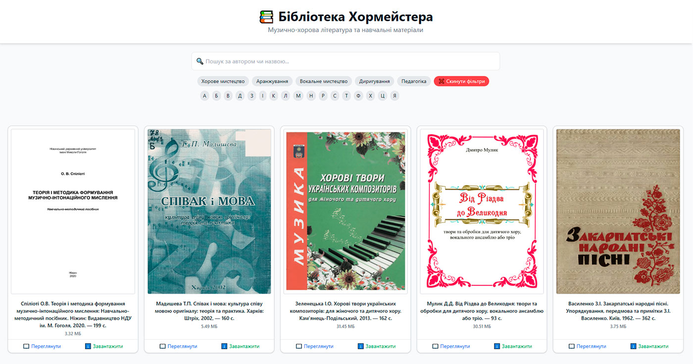
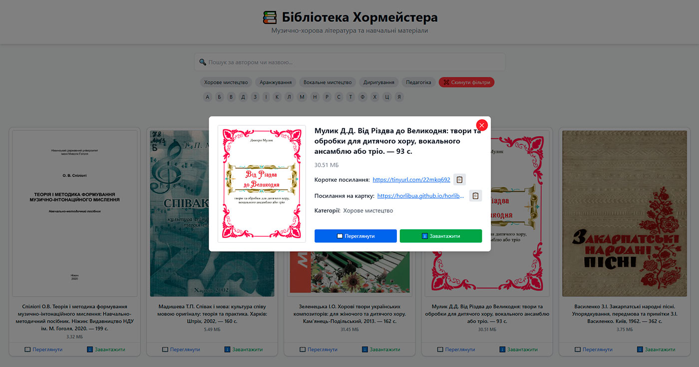

# 📚 Бібліотека Хормейстера

> Веб-бібліотека музично-хорової літератури, створена для зручного пошуку, перегляду та завантаження навчальних матеріалів.

🌍 [Відкрити онлайн → https://horlibua.github.io/](https://horlibua.github.io/)

---

## 📸 Інтерфейс бібліотеки
<table><tr><td>
  
  </td>
  <td>
  
</td></tr></table>

---

## 🌐 Опис проєкту

**Бібліотека Хормейстера** — це онлайн-каталог, який містить цифрові копії нот, навчальних посібників та інших матеріалів для хормейстерів, викладачів і студентів музичних навчальних закладів.

Сайт автоматично підвантажує дані з файлу [`books.json`](books.json), що містить інформацію про всі книги (назва, обкладинка, розмір, ключові слова, Google Drive ID тощо).

---

## ⚙️ Основні можливості

- 🔍 **Пошук** за назвою, автором або ключовими словами.  
- 🏷️ **Фільтрація за категоріями** (keywords).  
- 🔠 **Алфавітний покажчик** для швидкої навігації за першою літерою назви.  
- 📖 **Перегляд книги онлайн** у вбудованому PDF-вікні.  
- ⬇️ **Завантаження книги** з Google Drive одним кліком.  
- 🔗 **Детальна картка книги** із коротким посиланням, кнопками копіювання та інформацією про категорії.  
- ❌ **Кнопка “Скинути фільтри”** для швидкого очищення вибору.  
- 📱 **Адаптивний дизайн** — зручно користуватись на комп’ютері та смартфоні.  

---

## 🧩 Структура проєкту

```plaintext
📦 horlibua-library
├── index.html          # Головна сторінка бібліотеки
├── script.js           # Логіка пошуку, фільтрації та модальних вікон
├── style.css           # Кастомні стилі (доповнення до TailwindCSS)
├── books.json          # Дані про всі книги
├── assets/
│   ├── default_cover.png
│   └── icon.png         # іконка для сайта
│   └── screenshot1.jpg  # скріншот для README
│   └── screenshot2.jpg  # скріншот для README
└── README.md
```

У зв'язку з обмеженнями GiHub, самі книги зберігаються на Google Drive

---

## 📁 Формат books.json

```yaml
[
  {
    "title": "Хорова збірка для дітей",
    "file": "1a2b3c4d5e6f",
    "cover": "https://drive.google.com/thumbnail?id=1a2b3c4d5e6f",
    "short_url": "https://short.url/chorus",
    "size_mb": 12.5,
    "keywords": ["Дитячий хор", "Навчальні матеріали"]
  }
]
```

---

## 🛠️ Використані технології

- Tailwind CSS  — стилізація інтерфейсу
- Vanilla JavaScript (ES6+) — логіка пошуку та фільтрації
- Google Drive API / direct links — джерело файлів PDF
- Responsive Design — адаптація під різні пристрої

---

## 📸 Особливості дизайну

- Модальне вікно з адаптивною версткою: не розтягується навіть при довгих назвах.
- Всі довгі посилання обрізаються (truncate), але повний текст доступний у title.
- На мобільних категорії та алфавітні кнопки приховані під спойлером “Фільтри”.


